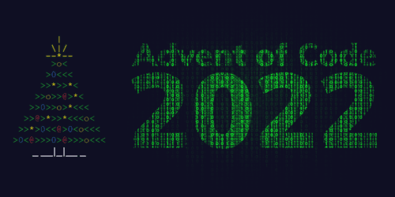

# 🎄 Advent_of_Code_2022 🎄
Every year I'm doing this with a new language. This year I chose **C**!

Advent of Code is an Advent calendar of programming puzzles that can be solved in any programming language you like.
A new set of puzzles is supplied every day as the advent of that day.

If you are interested in the problems, you can find them ***[here](https://adventofcode.com/2023/events)***.

I did this to get more familiar with **C**, solve programming puzzles, and, of course, for fun.

## 🔨 To improve

As I'm writing this later, I see some of the solutions are quite suboptimal, but atleast it shows how far I've come.
I could've done more days though.

I participated in this back in **2022**, but I revised this repository to fix stuff.

This was an introductory to the programming language of **C** and to **AoC** as well.
I still wanted to keep this repository here on github mainly to track my progress.
